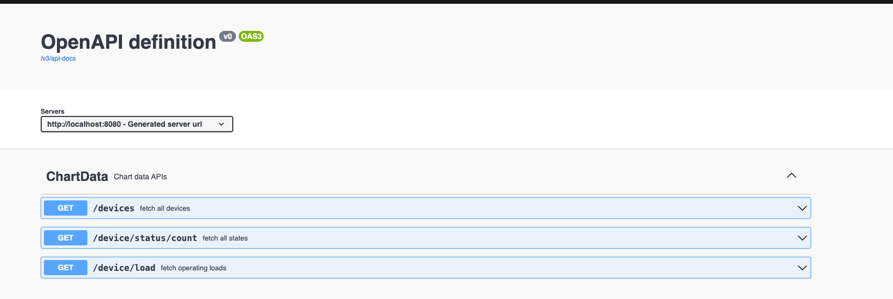

# Guidewheel backend

## Requirements

For building and running the application you need:

- [JDK 21](https://www.oracle.com/ca-en/java/technologies/downloads/#java21)
- [Maven 3](https://maven.apache.org)

## Running the application locally

There are several ways to run a Spring Boot application on your local machine. One way is to execute the `main` method in the `Main.jav` class from your IDE.

Alternatively you can use the [Spring Boot Maven plugin](https://docs.spring.io/spring-boot/docs/current/reference/html/build-tool-plugins-maven-plugin.html) like so:

```shell
mvn spring-boot:run
```

## Swagger

This app runs swagger by default and can be accessed from http://localhost:8080/swagger-ui/index.html#/ after running the app.



